# ICP Prediction Market Platform

A comprehensive decentralized prediction market platform built on the Internet Computer Protocol (ICP) with advanced AI-powered market analysis capabilities.

## Overview

This platform combines decentralized prediction markets with sophisticated AI agents to provide users with intelligent market analysis, optimal trading recommendations, and comprehensive risk assessment. The system features a modern web interface backed by ICP canisters and an advanced agent pipeline for market intelligence.

## Architecture

### Frontend Application

- **Next.js** with TypeScript for modern web interface
- **TailwindCSS** for responsive styling and design system
- **AgentJS** for seamless ICP blockchain integration
- **Chart.js** for real-time price visualization and analytics
- **Wallet Integration** supporting Plug, Stoic, and Internet Identity

### Backend Infrastructure

- **Motoko Canisters** for decentralized smart contract logic
  - Market Canister: Market creation, AMM trading, liquidity management
  - User Canister: User profiles, XP system, leaderboard tracking
  - Insight Canister: AI-powered market analysis integration
- **LMSR Algorithm** for automated market making and price discovery
- **Decentralized Storage** for market data and user information

### AI Agent Pipeline

- **Multi-Agent Architecture** with specialized analysis phases
- **Real-Time Research** via Tavily API integration
- **Advanced Analytics** with Kelly Criterion optimization
- **Scenario Analysis** for comprehensive risk assessment
- **Memory System** for continuous learning and performance tracking

## Agent System Architecture

### Core Processing Pipeline

```
Market Question → Research → Analysis → Prediction → Advice → Execution
```

### Agent Flow Diagrams

#### 1. SearchAgent

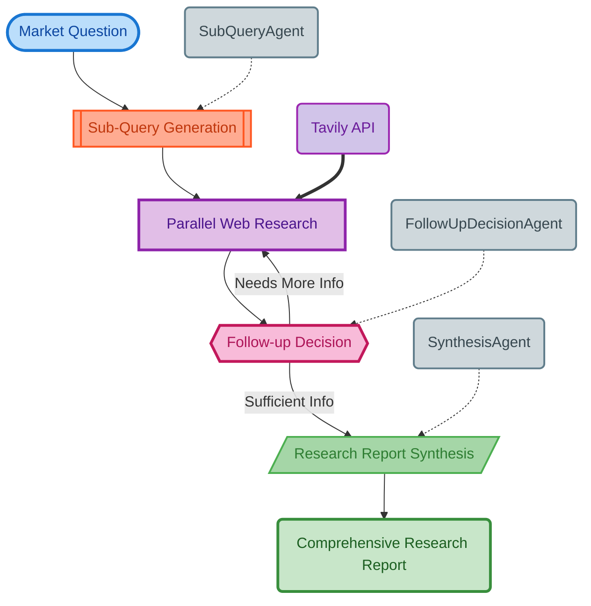

- Multi-iteration web research with adaptive follow-up queries
- Parallel query execution with intelligent caching
- Real-time market data aggregation from authoritative sources
- Comprehensive report synthesis with source citations

#### 2. AnalysisAgent

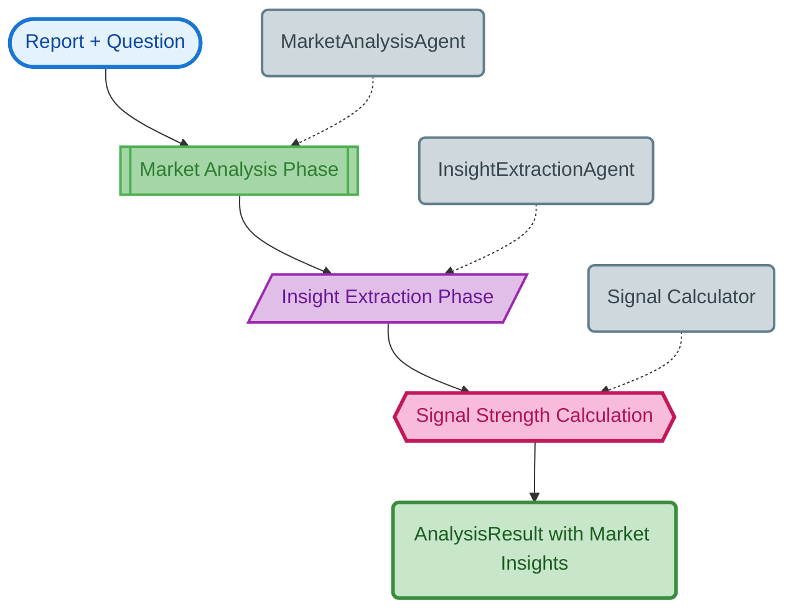

- Two-phase analysis: general insights to structured signals
- Market sentiment extraction with confidence weighting
- Signal strength calculation across multiple dimensions
- Risk factor identification and assessment

#### 3. PredictionAgent

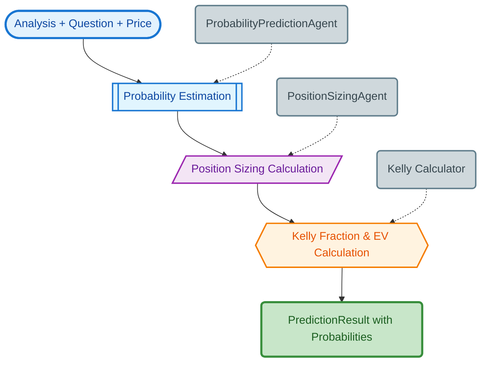

- Evidence-based probability calibration
- Kelly Criterion position sizing optimization
- Expected value calculation with risk adjustments
- Confidence interval estimation

#### 4. AdviceAgent

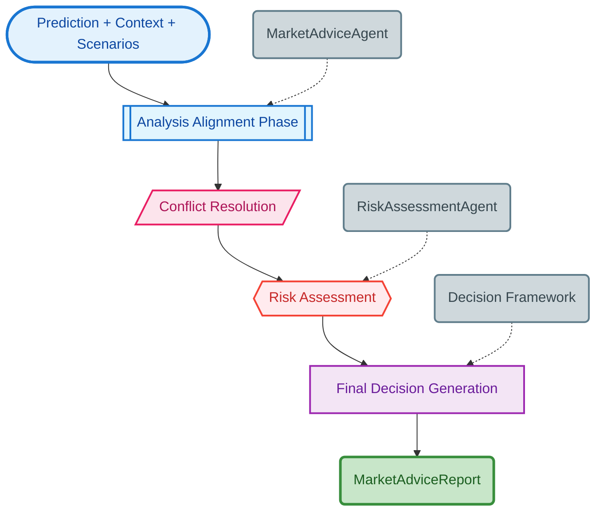

- Multi-source analysis alignment and conflict resolution
- Final trading decision with comprehensive risk assessment
- Clear execution recommendations with entry/exit strategies
- Decision confidence scoring

#### 5. ThinkThoroughlyAgent

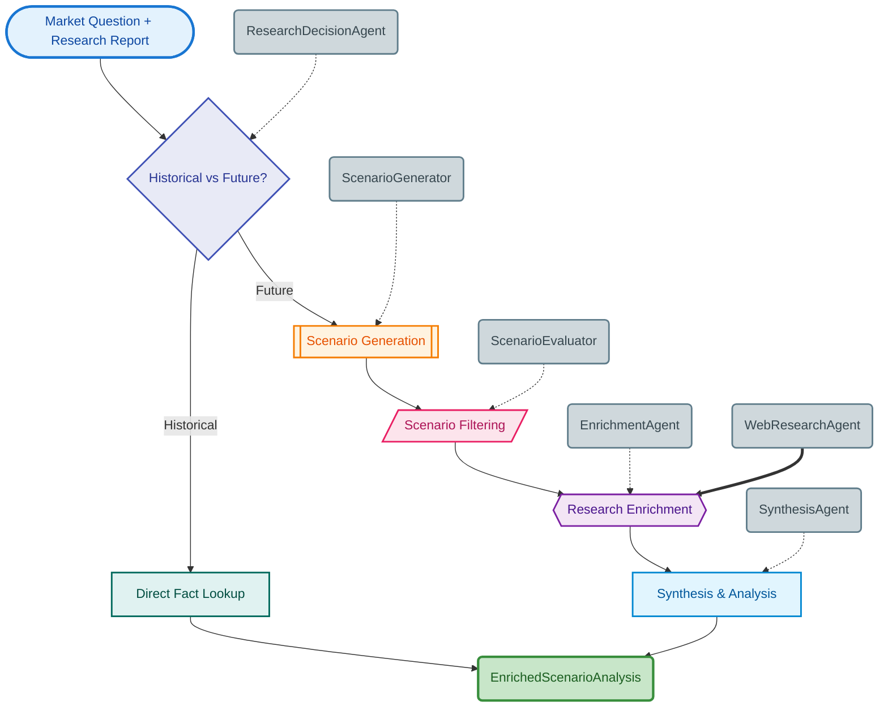

- Intelligent scenario analysis with temporal awareness
- Historical fact verification for past events
- Research enrichment with web-based validation
- Comprehensive scenario reporting and synthesis

### Supporting Systems

#### Market Generation Agents

**MarketEventAgent**: Event verification and status checking

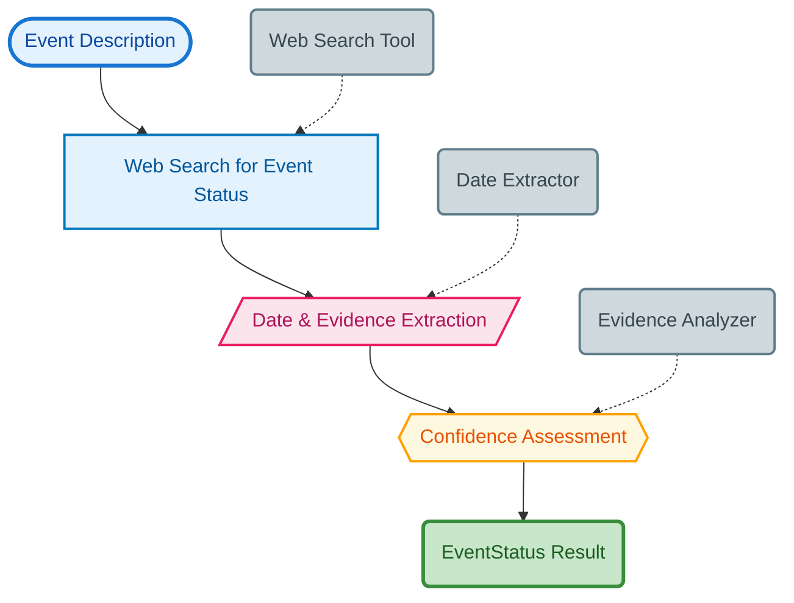

**NewsMarketAgent**: Automated market creation from trending news

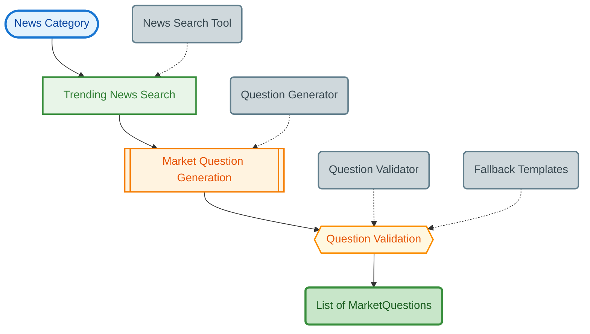

#### Optimization Systems

**AdvancedKellyOptimizer**: Sophisticated position sizing with multiple Kelly modes

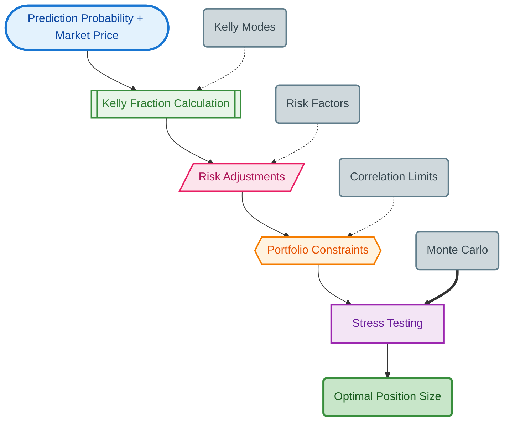

**MemorySystem**: Performance tracking, pattern detection, and learning insights

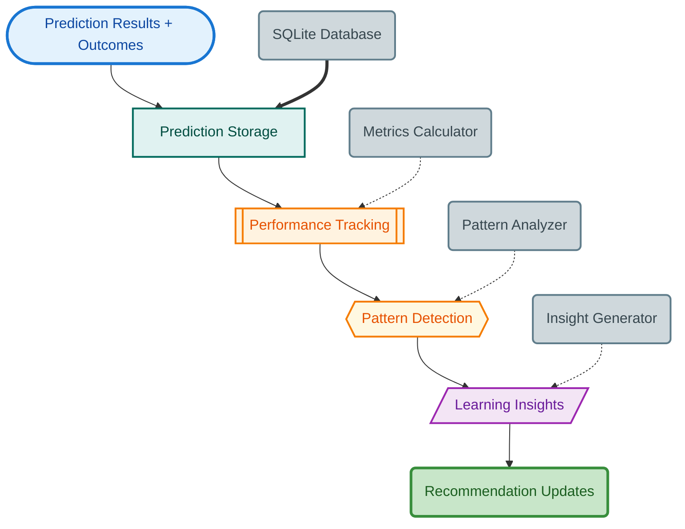

#### Pipeline Orchestration

**PipelineOrchestrator**: System coordination with timeout handling

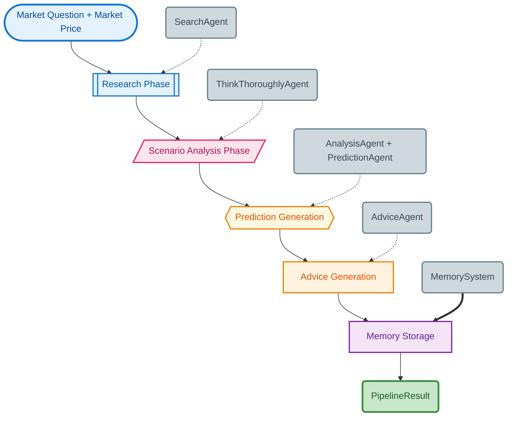

- **Error Recovery**: Robust error handling with exponential backoff
- **Async Processing**: High-performance concurrent execution

### Pipeline Orchestration Sequence Diagram

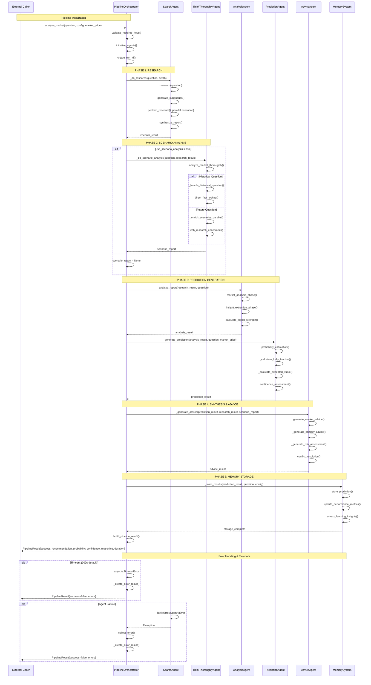

### Overall Pipeline Processing Flow

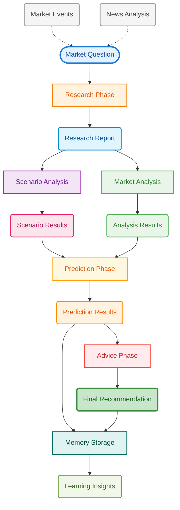

## Project Structure

```
ICP_hack/
│   ├── backend/
│   │   └── canisters/
│   │       ├── market.mo              # Market and AMM logic
│   │       ├── user.mo                # User profiles and leaderboard
│   │       └── insight.mo             # AI insights integration
│   ├── frontend/
│   │   ├── pages/                     # Next.js pages
│   │   ├── components/                # Reusable components
│   │   ├── hooks/                     # Custom React hooks
│   │   ├── utils/                     # Utility functions
│   │   └── types/                     # TypeScript definitions
│   └── agent_pipeline/
│       ├── core/                      # Pipeline orchestration
│       ├── icp_agents/               # Individual AI agents
│       │   ├── search/               # Market research
│       │   ├── analysis/             # Data analysis
│       │   ├── prediction/           # Probability estimation
│       │   ├── advice/               # Trading recommendations
│       │   ├── scenario/             # Scenario analysis
│       │   ├── market_event/         # Event verification
│       │   └── news_market/          # Market generation
│       ├── config/                   # Configuration management
│       ├── cli/                      # Command-line interface
│       ├── utils/                    # Shared utilities
│       └── tests/                    # Test suite
├── dfx.json                          # DFX configuration
└── package.json                      # Root package.json
```

## Features

### Core Functionality

- **Decentralized Markets**: Create and trade prediction markets on ICP
- **Automated Market Making**: LMSR-based price discovery mechanism
- **AI-Powered Insights**: Advanced market analysis and predictions
- **Risk Management**: Kelly Criterion optimization and risk assessment
- **Real-Time Data**: Live market research and trend analysis

### User Experience

- **Modern Interface**: Responsive design with intuitive navigation
- **Wallet Integration**: Multiple wallet options with seamless connection
- **Performance Tracking**: Comprehensive leaderboard and XP system
- **Rich Analytics**: Interactive charts and detailed market insights
- **Mobile Responsive**: Optimized for all device types

### Advanced Analytics

- **Scenario Planning**: Multi-scenario analysis with probability weighting
- **Memory Learning**: Continuous improvement through outcome tracking
- **Signal Processing**: Multi-dimensional market signal extraction
- **Temporal Analysis**: Historical fact verification and trend analysis
- **Confidence Scoring**: Uncertainty quantification for all predictions

## Installation and Setup

### Prerequisites

- Node.js 16 or higher
- DFX SDK for ICP development
- Python 3.9+ for AI agent pipeline
- Git for version control

### Environment Configuration

```bash
# Required API keys
export OPENAI_API_KEY="your_openai_api_key"
export TAVILY_API_KEY="your_tavily_api_key"

# Optional configurations
export ICP_NETWORK="local"  # or "ic" for mainnet
export PIPELINE_TIMEOUT="300"  # 5 minutes default
```

### Installation Steps

1. **Clone Repository**

   ```bash
   git clone <repository-url>
   cd icp_agents/ICP_hack
   ```

2. **Install DFX SDK**

   ```bash
   sh -ci "$(curl -fsSL https://sdk.dfinity.org/install.sh)"
   ```

3. **Install Dependencies**

   ```bash
   # Frontend dependencies
   cd frontend && npm install && cd ..

   # Python dependencies for AI pipeline
   cd agent_pipeline && pip install -r requirements.txt && cd ..
   ```

4. **Start Local Development**

   ```bash
   # Start ICP replica
   dfx start --background

   # Deploy canisters
   dfx deploy

   # Start frontend
   npm run frontend:dev
   ```

## Usage

### Command Line Interface

```bash
# Interactive AI agent pipeline
python -m agent_pipeline.cli.run

# Direct market analysis
python -m agent_pipeline.core.orchestrator
```

### Programmatic API

```python
from agent_pipeline.core.orchestrator import PipelineOrchestrator
from agent_pipeline.config import PipelineConfig

# Configure analysis pipeline
config = PipelineConfig(
    research_depth="standard",
    use_scenario_analysis=True,
    timeout_seconds=180
)

# Initialize orchestrator
orchestrator = PipelineOrchestrator()

# Analyze market
result = await orchestrator.analyze_market(
    "Will Bitcoin reach $100,000 by end of 2025?",
    config,
    market_price=0.35  # Current market probability
)

print(f"Recommendation: {result.recommendation}")
print(f"Probability: {result.probability:.1%}")
print(f"Confidence: {result.confidence}")
```

### Web Interface

1. **Market Creation**

   - Connect wallet (Plug, Stoic, or Internet Identity)
   - Navigate to "Create Market" section
   - Define market parameters and submit with stake
   - AI review and admin validation process

2. **Trading Operations**

   - Browse available markets on homepage
   - View detailed market analysis and AI insights
   - Execute trades using automated market maker
   - Monitor positions and performance metrics

3. **Performance Tracking**
   - Access comprehensive leaderboard system
   - Track XP progression and achievement badges
   - Analyze trading history and success metrics

## Development

### Local Development Commands

```bash
# Start complete development environment
npm run start

# Frontend development only
npm run frontend:dev

# Deploy backend canisters
npm run backend:deploy

# Run AI agent pipeline tests
cd agent_pipeline && python -m pytest tests/

# Type checking
npm run type-check
```

### Production Deployment

```bash
# Deploy to IC mainnet
npm run deploy:ic

# Build optimized frontend
npm run build

# Deploy with custom network
dfx deploy --network ic
```

### Testing

```bash
# Frontend tests
npm run test

# Backend canister tests
dfx canister call market test_all

# AI pipeline tests
cd agent_pipeline && python -m pytest tests/ -v

# Integration tests
npm run test:integration
```

## Configuration

### Agent Pipeline Settings

```python
# config/pipeline_config.py
PIPELINE_CONFIG = {
    "research_depth": "standard",  # quick, standard, deep
    "use_scenario_analysis": True,
    "timeout_seconds": 300,
    "max_follow_ups": 2,
    "cache_duration": 1800,  # 30 minutes
    "kelly_mode": "adaptive"
}
```

### Market Parameters

```motoko
// backend/canisters/market.mo
public type MarketConfig = {
    min_stake: Nat;
    max_markets_per_user: Nat;
    trading_fee_bps: Nat;
    resolution_bond: Nat;
    market_duration_days: Nat;
};
```

## API Reference

### Core Agent Methods

- `SearchAgent.research(question)`: Comprehensive market research
- `AnalysisAgent.analyze_report(report, question)`: Extract trading signals
- `PredictionAgent.generate_prediction(analysis, question)`: Probability estimation
- `AdviceAgent.generate_market_advice(prediction)`: Final recommendations
- `ThinkThoroughlyAgent.analyze_market_thoroughly(question)`: Scenario analysis

### Market Canister Interface

- `create_market(title, description, end_time)`: Create new prediction market
- `place_trade(market_id, outcome, amount)`: Execute trade on market
- `resolve_market(market_id, outcome)`: Resolve market outcome
- `get_market_info(market_id)`: Retrieve market details and pricing

### User Management

- `create_profile(username)`: Initialize user profile
- `update_xp(user_id, points)`: Award experience points
- `get_leaderboard(limit)`: Retrieve top users by performance

## Contributing

### Development Guidelines

1. Fork the repository and create feature branches
2. Follow TypeScript and Python style guidelines
3. Write comprehensive tests for new functionality
4. Update documentation for API changes
5. Submit pull requests with detailed descriptions

### Code Quality Standards

- **TypeScript**: Strict mode with comprehensive type definitions
- **Python**: PEP 8 compliance with type hints
- **Motoko**: Standard formatting with documentation
- **Testing**: Minimum 80% code coverage requirement
- **Documentation**: Inline comments and API documentation

## License

MIT License - See LICENSE file for complete terms and conditions.

## Support

For technical support, bug reports, or feature requests:

- Create GitHub issues for bug reports
- Join community discussions for general questions
- Review documentation for implementation details
- Contact maintainers for critical issues

---

Built with advanced AI agents and decentralized infrastructure for the next generation of prediction markets.
